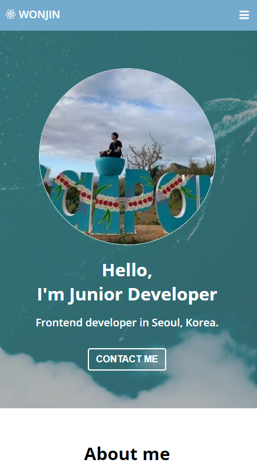
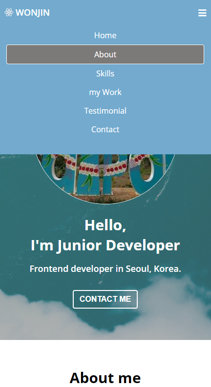

# Won's portfolio

## Project

- 프로젝트 : portfolio Web
- 개요 : HTML, CSS, JavaScript를 학습하기 위해 제작한 웹사이트입니다.
- 언어 : HTML, CSS, JavaScript
- 기간 : 21.05.14 ~ 07.22

### 주요 기능

- App을 실행시키면 그 휴대폰의 위치 정보를 요청합니다.
- 그 위치의 지역명과 날씨에 대한 실시간 정보를 화면을 통해 전달해줍니다.

### Portfolio Web [Link](https://won-jin-lee.github.io/portfolio-Web/)

---

## Wide Screen

## Small Screen

|                          |                         |
| ------------------------ | ----------------------- |
|  |  |
